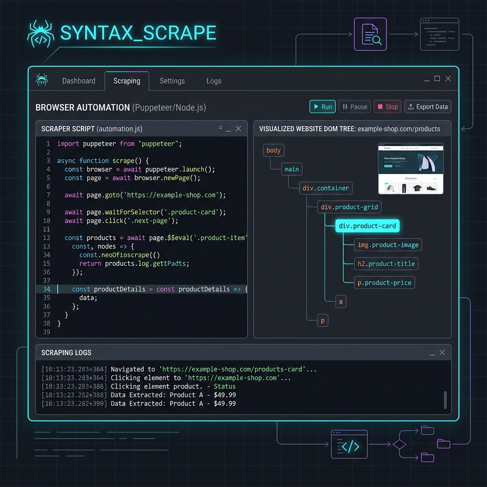

# 🛡️ Асинхронный Playwright Скрапер с обходом анти-ботов / Anti-Bot Playwright Scraper



Высокопроизводительный асинхронный скрапер на базе **Playwright** и **BeautifulSoup4**, спроектированный для парсинга веб-сайтов с динамической подгрузкой данных (JavaScript Rendering) и защиты от автоматических систем (Anti-Bot bypass).

---

## 🌟 Ключевые особенности / Features

- **Рендеринг JS**: Запуск полноценного headless-браузера Chromium для выполнения клиентских скриптов и полной прорисовки элементов страницы.
- **Обход детектирования**: Подмена флага `navigator.webdriver` на лету, настройка реалистичных размеров окна (`viewport`), часового пояса и системной локали для маскировки под реального пользователя.
- **Асинхронность**: Использование `playwright.async_api` для минимизации простоев во время сетевых задержек.
- **Тестовый Sandbox**: Настроен на парсинг `quotes.toscrape.com/js/` — интерактивный динамический сайт для тренировки веб-скрапинга.

---

## 📁 Структура проекта / Project Structure

```
anti-bot-scraper/
├── requirements.txt      # Зависимости проекта
├── .env.example          # Конфигурационный шаблон
├── scraper.py            # Класс скрапера с настройками браузера и сессии
└── main.py               # Точка входа для запуска
```

---

## 🚀 Установка и запуск / Setup & Run

### 1. Перейдите в папку проекта:
```bash
cd portfolio-projects/anti-bot-scraper/
```

### 2. Установите зависимости:
```bash
pip install -r requirements.txt
```

### 3. Установите бинарники браузеров Playwright:
```bash
playwright install chromium
```

### 4. Настройте конфигурацию:
Создайте файл `.env` из шаблона `.env.example`:
```bash
cp .env.example .env
```
Заполните `HEADLESS_MODE` в `.env`:
* `True` — браузер работает незаметно в фоновом режиме (по умолчанию).
* `False` — откроется реальное окно браузера Chromium, чтобы вы могли видеть действия скрипта.

### 5. Запустите парсер:
```bash
python main.py
```

---

## 🧬 Как это устроено / Implementation Details

1. **Инициализация**: Playwright запускает изолированный контекст Chromium с кастомным User-Agent.
2. **Маскировка**: Исполняется инициализационный скрипт, удаляющий маркеры автоматизации:
   ```javascript
   Object.defineProperty(navigator, 'webdriver', {get: () => undefined})
   ```
3. **Ожидание рендеринга**: Метод `page.wait_for_selector(".quote")` блокирует дальнейшее выполнение до тех пор, пока AJAX-запрос сайта не подгрузит контент и JS не создаст целевые HTML теги.
4. **Скрапинг**: Рендеренный HTML считывается и парсится через BeautifulSoup для быстрого извлечения текстов и метаданных.
