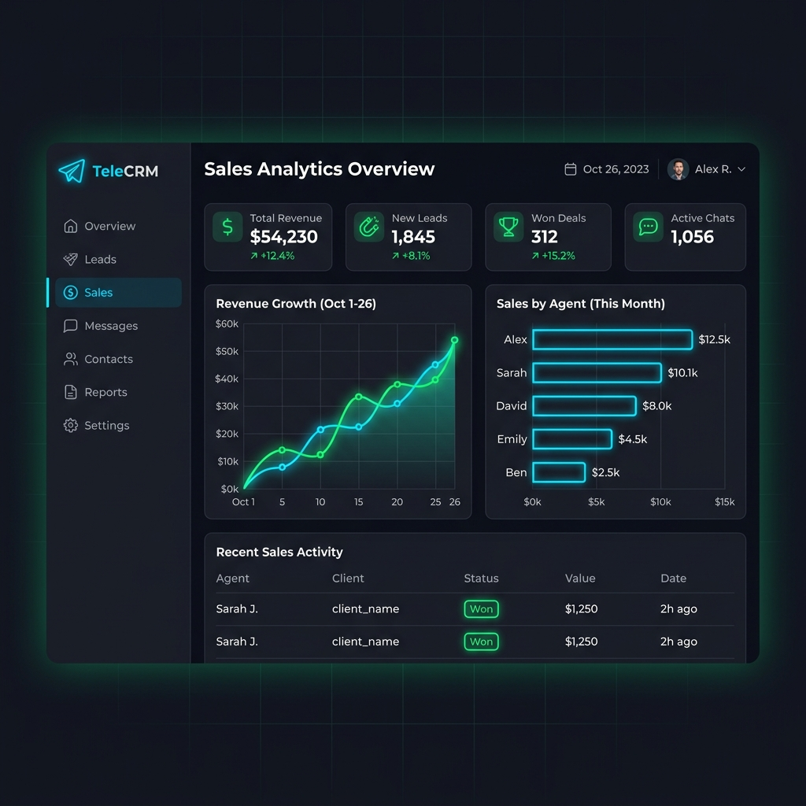

# 📊 CRM-Бот с аналитикой и рассылками / CRM Analytics & Broadcast Bot



Асинхронный Telegram-бот на базе **aiogram 3.x**, представляющий собой мини-CRM систему для владельцев бизнеса. 
Бот ведет учет пользователей и продаж в СУБД SQLite, генерирует аналитические графики с помощью библиотеки **matplotlib** и позволяет админу делать массовые рассылки сообщений через Конечные Автоматы (FSM).

---

## 🌟 Ключевые особенности / Features

- **Асинхронное ядро**: Разработан на `aiogram 3.x` и полностью асинхронном клиенте базы данных `aiosqlite`.
- **Генерация инфографики**: Рендеринг двухшкальных графиков продаж и регистраций за 7 дней (Линейный график + Столбчатая диаграмма) в отдельном потоке (`asyncio.to_thread`) на базе `matplotlib`.
- **Админ-панель**: Защищенный вход по Telegram User ID, просмотр общего числа клиентов, запуск массового вещания (рассылки).
- **Массовая рассылка (Broadcast)**: Пошаговый сбор контента для рассылки (поддерживает текст, разметку, медиафайлы) и безопасная пакетная отправка с ограничением скорости (`sleep`) для защиты от лимитов Telegram API.
- **Встроенные демонстрационные данные**: При первом запуске база данных автоматически заполняется тестовыми заказами за прошлую неделю, чтобы графики аналитики сразу выглядели красиво и наглядно.

---

## 📁 Структура проекта / Project Structure

```
crm-analytics-bot/
├── requirements.txt      # Зависимости проекта
├── .env.example          # Конфигурационный шаблон
├── config.py             # Настройки проекта
├── database.py           # SQLite база данных (регистрации, покупки)
├── analytics.py          # Модуль рендеринга аналитических графиков
├── keyboards.py          # Генератор меню управления
├── handlers.py           # Обработчики команд, симуляции оплат и рассылки
└── bot.py                # Точка входа для запуска
```

---

## 🚀 Установка и запуск / Setup & Run

### 1. Перейдите в папку проекта:
```bash
cd portfolio-projects/crm-analytics-bot/
```

### 2. Установите зависимости:
```bash
pip install -r requirements.txt
```

### 3. Настройте конфигурацию:
Создайте файл `.env` из шаблона `.env.example`:
```bash
cp .env.example .env
```
Заполните переменные окружения:
- `BOT_TOKEN` — токен вашего Telegram-бота.
- `ADMIN_ID` — ваш цифровой Telegram User ID (можно узнать у [@userinfobot](https://t.me/userinfobot) или аналогичного).

### 4. Запустите бота:
```bash
python bot.py
```

---

## 💡 Как это работает / Architecture

1. **База данных**: При старте бот создает файл `crm_database.db`. Если он пуст, скрипт имитирует регистрацию 20-30 пользователей и покупки за прошедшие 7 дней.
2. **Аналитика**: По клику администратора на кнопку «Показать Аналитику», модуль `analytics.py` строит темный график динамики продаж и регистраций, сохраняет его как временный PNG-файл и отправляет администратору в чат.
3. **Рассылка**: Когда администратор отправляет сообщение для рассылки, бот копирует структуру сообщения (`copy_message`) и дублирует его всем пользователям из базы данных с небольшим интервалом (защита от флуд-контроля).
