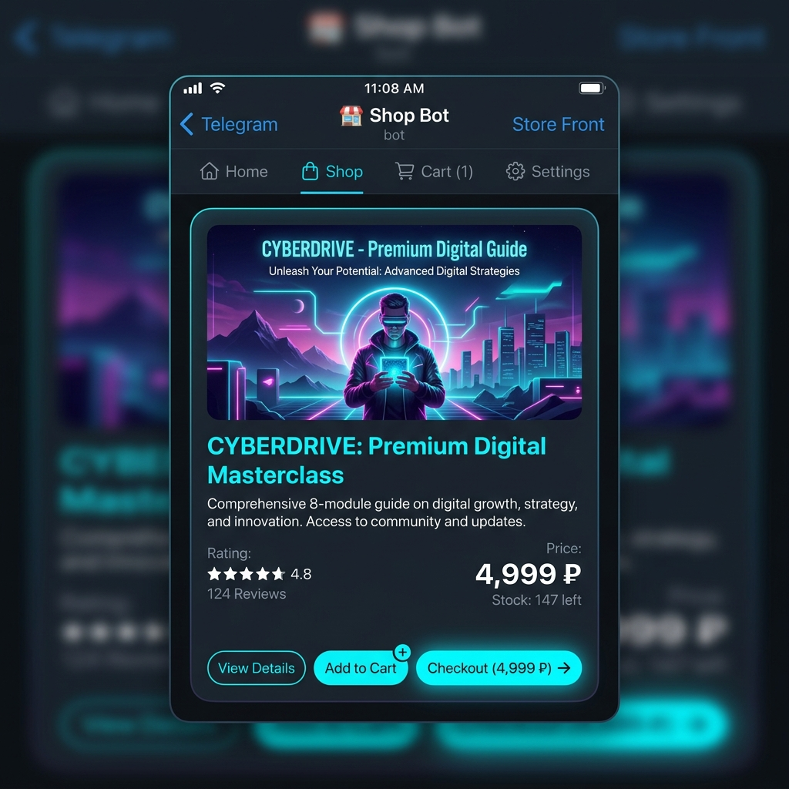

# 🛍️ Premium Telegram Shop Bot (`aiogram 3.x`)



Асинхронный Telegram-бот интернет-магазин цифровых услуг и готовых IT-решений. Разработан на современном стеке с использованием асинхронных баз данных и FSM (конечных автоматов).

---

## 🛠️ Технологический стек

* **Язык:** Python 3.10+
* **Библиотека:** `aiogram 3.x` (современный асинхронный фреймворк для Telegram Bot API)
* **База данных:** `aiosqlite` (асинхронная надстройка над SQLite3 для полностью неблокирующих операций)
* **Настройки:** `python-dotenv` (безопасное управление конфигурацией через переменные окружения)
* **FSM:** `MemoryStorage` от `aiogram` (конечные автоматы для пошагового сбора данных от администратора)

---

## ✨ Основной функционал

1. **🛍️ Каталог товаров:**
   - Динамическое формирование Inline-клавиатур с ценами из базы данных.
   - Полнотекстовое описание карточки товара при переходе.
2. **🛒 Умная Корзина (CRUD):**
   - Возможность добавления товаров из каталога.
   - Изменение количества («➕», «➖» кнопками) или удаление товаров прямо внутри интерфейса корзины.
   - Автоматический пересчет суммы в реальном времени.
3. **💳 Симуляция оплаты:**
   - Оформление заказа и сохранение его в СУБД с уникальным ID заказа.
   - Перевод пользователя на тестовый платежный интерфейс (Mock CryptoPay).
4. **🛡️ Админ-панель (FSM):**
   - Доступ по уникальному Telegram User ID.
   - Пошаговое добавление товаров с клавиатурными проверками валидности ввода (цена, название).
   - Список товаров с кнопками мгновенного удаления из базы.

---

## 📁 Структура проекта

```
tg-shop-bot/
├── .env.example       # Шаблон конфигурационных данных
├── requirements.txt   # Список зависимостей
├── bot.py             # Главный файл для запуска
├── config.py          # Модуль загрузки настроек
├── database.py        # Инициализация СУБД и хелперы запросов
├── keyboards.py       # Генераторы Inline-клавиатур
├── handlers.py        # Обработчики команд, коллбэков и стейтов (FSM)
└── shop_database.db   # Файл базы данных SQLite (генерируется при первом запуске)
```

---

## 🚀 Установка и запуск

### 1. Клонирование и переход в папку проекта:
```bash
git clone https://github.com/Rage213/nexus-labs.git
cd resilient-kepler/portfolio-projects/tg-shop-bot/
```

### 2. Установка зависимостей:
```bash
pip install -r requirements.txt
```

### 3. Настройка переменных окружения:
Переименуйте файл `.env.example` в `.env` и введите ваш токен бота и Telegram ID для доступа к админке:
```env
BOT_TOKEN=YOUR_TELEGRAM_BOT_TOKEN_HERE
DB_PATH=shop_database.db
ADMIN_ID=YOUR_TELEGRAM_USER_ID_HERE
```

### 4. Запуск:
```bash
python bot.py
```

---

## 🧬 Описание схемы СУБД

База данных SQLite содержит три основные связанные таблицы:
* `products`: Информация о товарах (название, описание, цена, картинка). При первом запуске автоматически заполняется демо-товарами.
* `cart`: Состояние корзины (пользователь, ID товара, количество).
* `orders`: История заказов (ID заказа, пользователь, сумма, статус, время создания).
